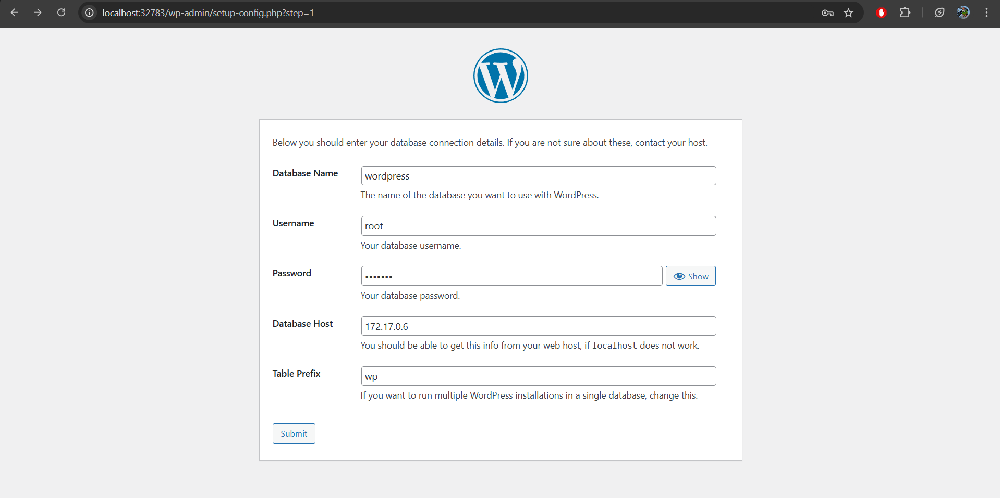
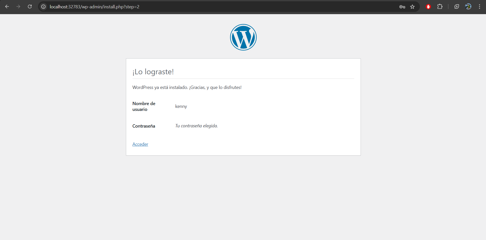
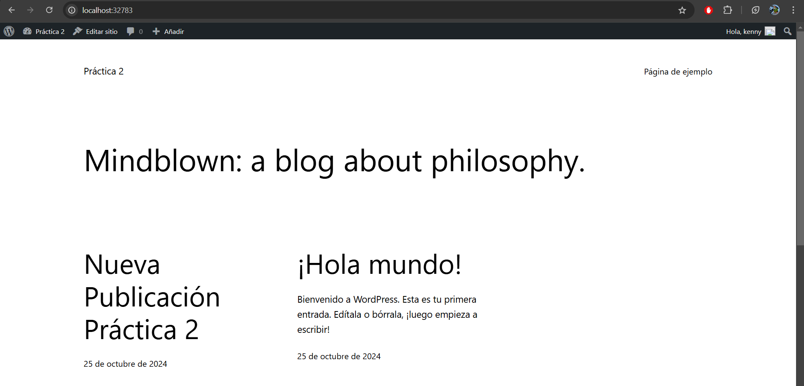

## Esquema para el ejercicio


### Crear la red
```
docker network create net-wp
```

### Crear el contenedor mysql a partir de la imagen mysql:8, configurar las variables de entorno necesarias
```
docker run -P -d --name mysql --env-file=variables_mysql.txt mysql:8
```

### Crear el contenedor wordpress a partir de la imagen: wordpress, configurar las variables de entorno necesarias
```
docker run -d --name wordpress -p 32783:80 wordpress
```

De acuerdo con el trabajo realizado, en el esquema de ejercicio el puerto a es 32783.

Ingresar desde el navegador al wordpress y finalizar la configuración de instalación.



Desde el panel de admin: cambiar el tema y crear una nueva publicación.
Ingresar a: http://localhost:9300/ 
recordar que a es el puerto que usó para el mapeo con wordpress


### Eliminar el contenedor wordpress
```
docker rm wordpress
```

### Crear nuevamente el contenedor wordpress
Ingresar a: http://localhost:9300/ 
recordar que a es el puerto que usó para el mapeo con wordpress

### ¿Qué ha sucedido, qué puede observar?

El contenido se reseta y aparece nuevamente la pagina para realizar las configuraciones.

